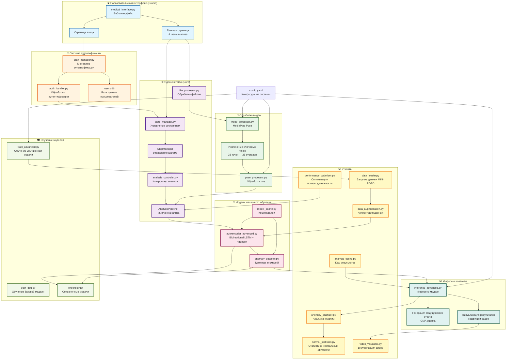
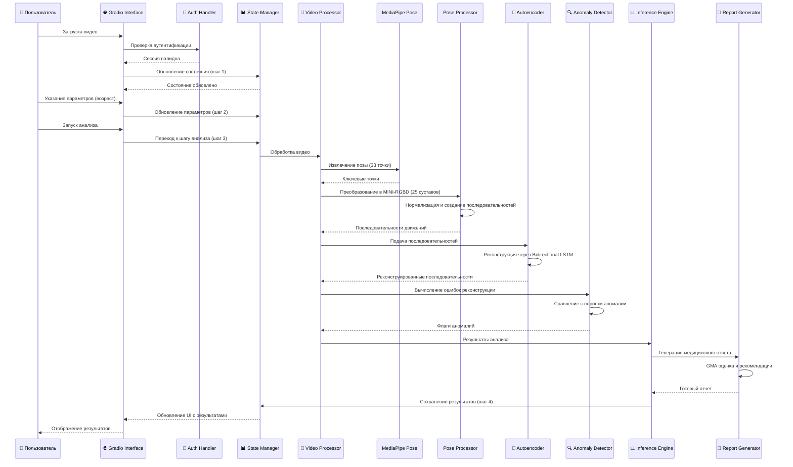
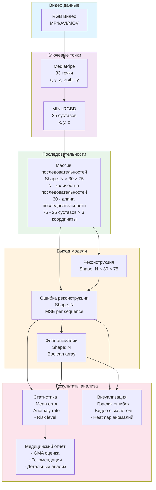

# Архитектура системы детекции аномалий движений младенцев

## Диаграмма архитектуры системы

## Поток обработки видео

## Архитектура модели

```mermaid
graph LR
    subgraph INPUT["Входные данные"]
        VIDEO["RGB Видео<br/>Младенец на спине"]
    end

    subgraph EXTRACTION["Извлечение признаков"]
        MP["MediaPipe Pose<br/>33 ключевые точки"]
        CONV["Преобразование<br/>33 → 25 суставов<br/>MINI-RGBD формат"]
        NORM["Нормализация<br/>- Относительно торса<br/>- Bounding box<br/>- Каноническая ориентация"]
        SEQ["Создание последовательностей<br/>Длина: 30 кадров<br/>Шаг: 1 кадр"]
    end

    subgraph ENCODER["Энкодер"]
        BI_LSTM1["Bidirectional LSTM<br/>256 hidden units"]
        BI_LSTM2["Bidirectional LSTM<br/>128 hidden units"]
        BI_LSTM3["Bidirectional LSTM<br/>64 hidden units"]
        ATT["Multi-head Attention<br/>4 головы"]
        LATENT["Латентное представление<br/>64 размерности"]
    end

    subgraph DECODER["Декодер"]
        LSTM1["LSTM<br/>64 → 128"]
        LSTM2["LSTM<br/>128 → 256"]
        LSTM3["LSTM<br/>256 → 75"]
        OUTPUT["Реконструированная<br/>последовательность<br/>75 размерностей"]
    end

    subgraph DETECTION["Детекция аномалий"]
        MSE["MSE Loss<br/>Ошибка реконструкции"]
        THRESHOLD["Порог аномалии<br/>95-й перцентиль<br/>на validation данных"]
        ANOMALY["Флаг аномалии<br/>True/False"]
    end

    VIDEO --> MP
    MP --> CONV
    CONV --> NORM
    NORM --> SEQ
    
    SEQ --> BI_LSTM1
    BI_LSTM1 --> BI_LSTM2
    BI_LSTM2 --> BI_LSTM3
    BI_LSTM3 --> ATT
    ATT --> LATENT
    
    LATENT --> LSTM1
    LSTM1 --> LSTM2
    LSTM2 --> LSTM3
    LSTM3 --> OUTPUT
    
    SEQ --> MSE
    OUTPUT --> MSE
    MSE --> THRESHOLD
    THRESHOLD --> ANOMALY

    style INPUT fill:#e3f2fd
    style EXTRACTION fill:#f1f8e9
    style ENCODER fill:#fff3e0
    style DECODER fill:#fce4ec
    style DETECTION fill:#ffebee
```

## Структура данных

## Компоненты системы

### 1. Пользовательский интерфейс (UI)
- **medical_interface.py**: Gradio веб-интерфейс
- **4 шага анализа**: Загрузка → Параметры → Анализ → Результаты
- **Аутентификация**: Вход/регистрация пользователей

### 2. Система аутентификации
- **auth_manager.py**: Управление сессиями и пользователями
- **auth_handler.py**: Обработка запросов аутентификации
- **users.db**: SQLite база данных пользователей

### 3. Ядро системы (Core)
- **state_manager.py**: Централизованное управление состоянием приложения
- **file_processor.py**: Универсальная обработка файлов из Gradio
- **analysis_controller.py**: Контроллер процесса анализа
- **StepManager**: Управление шагами интерфейса
- **AnalysisPipeline**: Пайплайн анализа с поддержкой отмены

### 4. Обработка видео
- **video_processor.py**: Обработка видео через MediaPipe Pose
- **pose_processor.py**: Преобразование поз в формат MINI-RGBD
- Извлечение 33 ключевых точек → преобразование в 25 суставов
- Нормализация и создание последовательностей

### 5. Модели машинного обучения
- **autoencoder_advanced.py**: Bidirectional LSTM + Attention автоэнкодер
- **anomaly_detector.py**: Детектор аномалий на основе ошибки реконструкции
- **model_cache.py**: Кэширование загруженных моделей

### 6. Утилиты
- **data_loader.py**: Загрузка данных из датасета MINI-RGBD
- **data_augmentation.py**: Аугментация данных для обучения
- **normal_statistics.py**: Статистика нормальных движений
- **anomaly_analyzer.py**: Детальный анализ аномалий
- **video_visualizer.py**: Визуализация результатов на видео
- **analysis_cache.py**: Кэширование результатов анализа
- **performance_optimizer.py**: Оптимизация производительности

### 7. Инференс и отчеты
- **inference_advanced.py**: Инференс улучшенной модели
- Генерация медицинских отчетов в формате GMA
- Визуализация результатов (графики, видео с скелетом)

### 8. Обучение моделей
- **train_advanced.py**: Обучение Bidirectional LSTM + Attention модели
- **train_gpu.py**: Обучение базовой модели
- **checkpoints/**: Сохраненные модели и детекторы

## Технологический стек

- **Python 3.8+**
- **PyTorch**: Глубокое обучение
- **MediaPipe**: Извлечение позы
- **Gradio**: Веб-интерфейс
- **SQLite**: База данных пользователей
- **OpenCV**: Обработка видео
- **NumPy**: Вычисления
- **Matplotlib**: Визуализация

## Поток данных

1. **Загрузка видео** → Валидация → Сохранение во временную директорию
2. **Извлечение позы** → MediaPipe Pose → 33 ключевые точки
3. **Преобразование** → MINI-RGBD формат → 25 суставов
4. **Нормализация** → Относительно торса, bounding box, каноническая ориентация
5. **Создание последовательностей** → Длина 30 кадров, шаг 1 кадр
6. **Реконструкция** → Bidirectional LSTM автоэнкодер
7. **Детекция аномалий** → Сравнение ошибки реконструкции с порогом
8. **Генерация отчета** → GMA оценка, статистика, рекомендации
9. **Визуализация** → Графики, видео с наложенным скелетом

## Особенности архитектуры

- ✅ **Модульность**: Четкое разделение компонентов
- ✅ **Управление состоянием**: Централизованное состояние через StateManager
- ✅ **Кэширование**: Кэш моделей и результатов анализа
- ✅ **Оптимизация**: Оптимизация памяти и производительности
- ✅ **Отмена операций**: Поддержка отмены длительных операций
- ✅ **Аутентификация**: Система пользователей и сессий
- ✅ **Валидация**: Проверка входных данных на всех этапах
